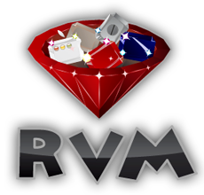

!SLIDE center

## RVM is a command line tool which allows us to easily install, manage and work with multiple ruby environments from interpreters to sets of gems.

### [rvm.beginrescueend.com](http://rvm.beginrescueend.com/)

!SLIDE commandline
# RVM

    $ rvm list

    rvm rubies

!SLIDE commandline
# RVM

    $ rvm install ruby-1.9.2
    $ rvm install ruby-1.8.7
    $ rvm install ree

!SLIDE commandline
# RVM

    $ rvm list

    rvm rubies

       jruby-1.5.6 [ x86_64-java ]
       jruby-1.6.0.RC1 [ darwin-x86_64-java ]
       rbx-head [ x86_64 ]
       ree-1.8.7-2010.02 [ x86_64 ]
       ruby-1.8.7-p330 [ x86_64 ]
    => ruby-1.9.2-p0 [ x86_64 ]
       ruby-1.9.2-p136 [ x86_64 ]

!SLIDE commandline
# RVM

    $ rvm use ruby-1.9.2 --default
    $ ruby --version
    ruby 1.9.2p0 (2010-08-18 revision 29036) [x86_64-darwin10.5.0]
    
    $ rvm use 1.8.7
    $ ruby --version
    ruby 1.8.7 (2010-12-23 patchlevel 330) [i686-darwin10.5.0]
    
    $ rvm use default
    $ ruby --version
    ruby 1.9.2p0 (2010-08-18 revision 29036) [x86_64-darwin10.5.0]

!SLIDE commandline
# IRB

    $ irb
    
    ruby-1.9.2-p0 :001 > 1 + 1
     => 2 
    ruby-1.9.2-p0 :002 > Object.new.class
     => Object 
    ruby-1.9.2-p0 :003 > "Hello" + " " + "from IRB"
     => "Hello from IRB" 
    ruby-1.9.2-p0 :004 > 

